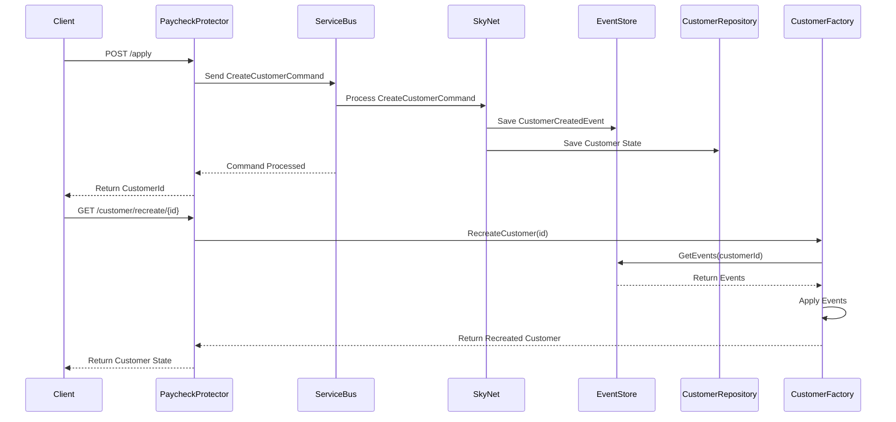

```mermaid
sequenceDiagram
    participant Client
    participant PaycheckProtector
    participant ServiceBus
    participant SkyNet
    participant EventStore
    participant CustomerRepository

    %% Create User Flow
    Client->>PaycheckProtector: POST /apply
    PaycheckProtector->>ServiceBus: Send CreateCustomerCommand
    ServiceBus->>SkyNet: Process CreateCustomerCommand

    %% Event Handling
    SkyNet->>EventStore: Save CustomerCreatedEvent
    SkyNet->>CustomerRepository: Save Customer State
    ServiceBus-->>PaycheckProtector: Command Processed
    PaycheckProtector-->>Client: Return CustomerId

    %% Recreate User Flow
    Client->>PaycheckProtector: GET /customer/recreate/{id}
    PaycheckProtector->>CustomerFactory: RecreateCustomer(id)
    CustomerFactory->>EventStore: GetEvents(customerId)
    EventStore-->>CustomerFactory: Return Events
    CustomerFactory->>CustomerFactory: Apply Events
    CustomerFactory-->>PaycheckProtector: Return Recreated Customer
    PaycheckProtector-->>Client: Return Customer State
```
