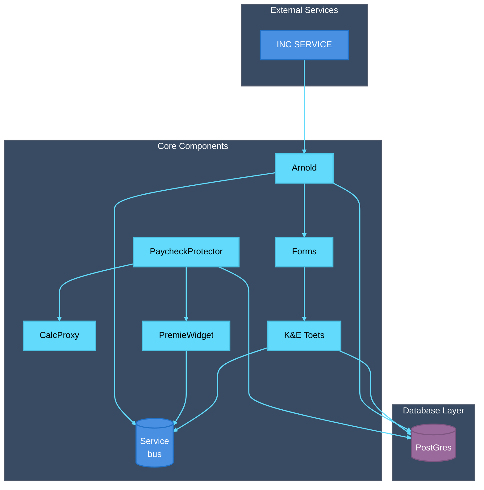

```mermaid

  %%{init: {
  'theme': 'base',
  'themeVariables': {
    'fontFamily': 'arial',
    'primaryColor': '#384B62',
    'primaryTextColor': '#fff',
    'primaryBorderColor': '#fff',
    'lineColor': '#61dafb',
    'secondaryColor': '#006100',
    'tertiaryColor': '#fff'
  }
}}%%

flowchart TB
    %% Added spacing with empty nodes
    subgraph Space1[" "]
        style Space1 fill:none,stroke:none
        SPACE1[" "]
        style SPACE1 fill:none,stroke:none
    end

    subgraph External["External Services"]
        INC["INC SERVICE"]
        style INC fill:#4A90E2,stroke:#2171C7,stroke-width:2px,color:#fff
    end

    subgraph Space2[" "]
        style Space2 fill:none,stroke:none
        SPACE2[" "]
        style SPACE2 fill:none,stroke:none
    end

    subgraph Database["Database Layer"]
        DB[("PostGres")]
        style DB fill:#9B6A9C,stroke:#7E5580,stroke-width:2px,color:#fff
    end

    subgraph Components["Core Components"]
        direction TB
        AR["Arnold"]
        PP["PaycheckProtector"]
        CP["CalcProxy"]
        PW["PremieWidget"]
        KT["K&E Toets"]
        SB[("Service\nbus")]
        FM["Forms"]

        style AR fill:#61DAFB,stroke:#4CC2E4,stroke-width:2px,color:#000
        style PP fill:#61DAFB,stroke:#4CC2E4,stroke-width:2px,color:#000
        style CP fill:#61DAFB,stroke:#4CC2E4,stroke-width:2px,color:#000
        style PW fill:#61DAFB,stroke:#4CC2E4,stroke-width:2px,color:#000
        style KT fill:#61DAFB,stroke:#4CC2E4,stroke-width:2px,color:#000
        style SB fill:#4A90E2,stroke:#2171C7,stroke-width:2px,color:#fff
        style FM fill:#61DAFB,stroke:#4CC2E4,stroke-width:2px,color:#000
    end

    %% Connections
    PP ---> CP
    PP ---> PW
    PP ---> DB
    AR ---> DB
    AR ---> SB
    PW ---> SB
    KT ---> SB
    KT ---> DB
    FM ---> KT
    INC ---> AR
    AR ---> FM

    %% Styling for subgraphs
    style External fill:#384B62,stroke:#4A5568,stroke-width:2px,color:#fff
    style Database fill:#384B62,stroke:#4A5568,stroke-width:2px,color:#fff
    style Components fill:#384B62,stroke:#4A5568,stroke-width:2px,color:#fff

    %% Link styling
    linkStyle default stroke:#61dafb,stroke-width:2px
```
