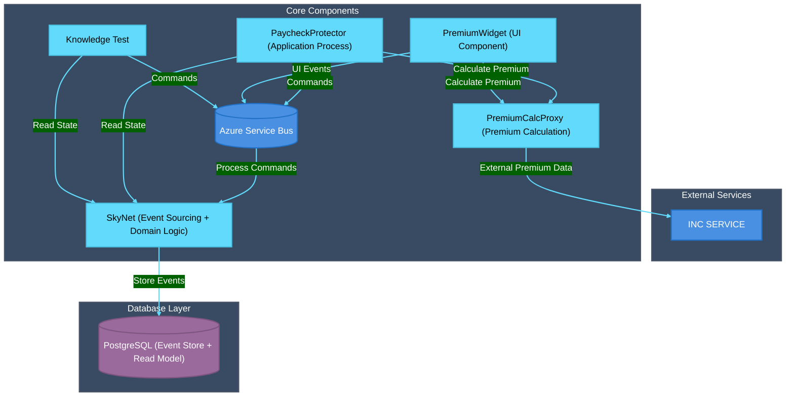

```mermaid

  %%{init: {
  'theme': 'base',
  'themeVariables': {
    'fontFamily': 'arial',
    'primaryColor': '#384B62',
    'primaryTextColor': '#fff',
    'primaryBorderColor': '#fff',
    'lineColor': '#61dafb',
    'secondaryColor': '#006100',
    'tertiaryColor': '#fff'
  }
}}%%

flowchart TB
    subgraph External["External Services"]
        INC["INC SERVICE"]
        style INC fill:#4A90E2,stroke:#2171C7,stroke-width:2px,color:#fff
    end

    subgraph Database["Database Layer"]
        DB[("PostgreSQL (Event Store + Read Model)")]
        style DB fill:#9B6A9C,stroke:#7E5580,stroke-width:2px,color:#fff
    end

    subgraph Components["Core Components"]
        direction TB
        SKYNET["SkyNet (Event Sourcing + Domain Logic)"]
        PP["PaycheckProtector (Application Process)"]
        CP["PremiumCalcProxy (Premium Calculation)"]
        PW["PremiumWidget (UI Component)"]
        KT["Knowledge Test"]
        SB[("Azure Service Bus")]

        style SKYNET fill:#61DAFB,stroke:#4CC2E4,stroke-width:2px,color:#000
        style PP fill:#61DAFB,stroke:#4CC2E4,stroke-width:2px,color:#000
        style CP fill:#61DAFB,stroke:#4CC2E4,stroke-width:2px,color:#000
        style PW fill:#61DAFB,stroke:#4CC2E4,stroke-width:2px,color:#000
        style KT fill:#61DAFB,stroke:#4CC2E4,stroke-width:2px,color:#000
        style SB fill:#4A90E2,stroke:#2171C7,stroke-width:2px,color:#fff
    end

    %% Connections with labeled edges
    PP -->|"Commands"| SB
    SB -->|"Process Commands"| SKYNET
    SKYNET -->|"Store Events"| DB
    PP -->|"Read State"| SKYNET
    PP -->|"Calculate Premium"| CP
    PW -->|"UI Events"| SB
    PW -->|"Calculate Premium"| CP
    KT -->|"Commands"| SB
    KT -->|"Read State"| SKYNET
    CP -->|"External Premium Data"| INC

    %% Styling for subgraphs
    style External fill:#384B62,stroke:#4A5568,stroke-width:2px,color:#fff
    style Database fill:#384B62,stroke:#4A5568,stroke-width:2px,color:#fff
    style Components fill:#384B62,stroke:#4A5568,stroke-width:2px,color:#fff

    %% Link styling
    linkStyle default stroke:#61dafb,stroke-width:2px
```
